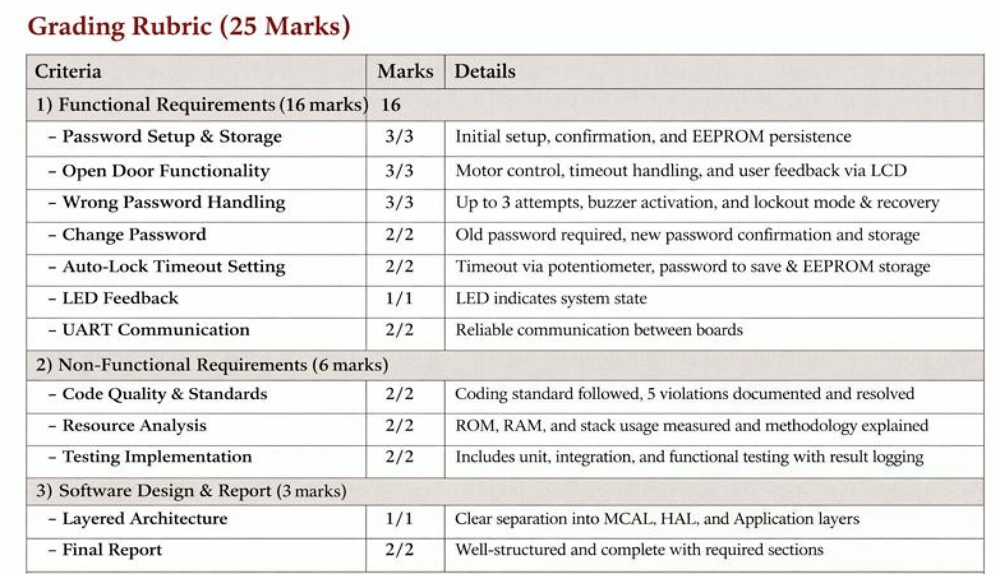

# Door Locker Security System

A two-MCU embedded security system using TM4C123GH6PM (Tiva C LaunchPad).

## Overview

| MCU                   | Role           | Components                          |
| --------------------- | -------------- | ----------------------------------- |
| Frontend (HMI_ECU)    | User Interface | LCD, Keypad, RGB LED, Potentiometer |
| Backend (Control_ECU) | Security Logic | Motor, Buzzer, EEPROM, Status LEDs  |

---

## System Flow

```
┌─────────────┐     ┌─────────────┐     ┌─────────────┐
│   Welcome   │────>│   Signup    │────>│  Main Menu  │
│   Screen    │     │ (1st time)  │     │             │
└─────────────┘     └─────────────┘     └──────┬──────┘
                                               │
                    ┌──────────────────────────┼──────────────────────────┐
                    v                          v                          v
              ┌──────────┐              ┌──────────┐              ┌──────────┐
              │ Sign In  │              │  Change  │              │   Set    │
              │   (A)    │              │ Pass (*) │              │ Time (C) │
              └────┬─────┘              └──────────┘              └──────────┘
                   │
      ┌────────────┼────────────┐
      v            v            v
┌──────────┐ ┌──────────┐ ┌──────────┐
│ Success  │ │  Wrong   │ │ Lockout  │
│Door Opens│ │ Password │ │ (Buzzer) │
└────┬─────┘ └──────────┘ └──────────┘
     │
     v
┌──────────────────────────────────────┐
│  Automated Door Sequence (Backend)   │
│  Motor CW (open) → Timer → Motor CCW │
└──────────────────────────────────────┘
```

---

## Menu Keys

| Key | Function                    |
| --- | --------------------------- |
| A   | Sign In (open door)         |
| \*  | Change Password             |
| C   | Set Timeout (potentiometer) |
| D   | Save/Confirm                |
| #   | Cancel/Backspace            |
| 0-9 | Password digits             |

---

## Hardware Connections

### Frontend (HMI_ECU)

#### UART1

| Signal | Pin | Description     |
| ------ | --- | --------------- |
| RX     | PB0 | From Backend TX |
| TX     | PB1 | To Backend RX   |

#### LCD (I2C0 - PCF8574 Backpack)

| Signal | Pin | Description    |
| ------ | --- | -------------- |
| SCL    | PB2 | I2C Clock      |
| SDA    | PB3 | I2C Data       |
| Addr   | -   | 0x27 (or 0x3F) |

#### Keypad (4x4 Matrix)

| Signal | Pin | Type               |
| ------ | --- | ------------------ |
| Row 0  | PC4 | Input with Pull-up |
| Row 1  | PC5 | Input with Pull-up |
| Row 2  | PC6 | Input with Pull-up |
| Row 3  | PC7 | Input with Pull-up |
| Col 0  | PB6 | Output             |
| Col 1  | PA4 | Output             |
| Col 2  | PA3 | Output             |
| Col 3  | PA2 | Output             |

#### Potentiometer (ADC)

| Signal | Pin | Description         |
| ------ | --- | ------------------- |
| Signal | PB5 | ADC0 AIN11 (0-4095) |

#### RGB LED (Onboard)

| Color | Pin | Meaning             |
| ----- | --- | ------------------- |
| Red   | PF1 | Error/Lockout       |
| Blue  | PF2 | Processing/Settings |
| Green | PF3 | Success             |

---

### Backend (Control_ECU)

#### UART1

| Signal | Pin | Description      |
| ------ | --- | ---------------- |
| RX     | PB0 | From Frontend TX |
| TX     | PB1 | To Frontend RX   |

#### Motor (via H-Bridge)

| Signal | Pin | Description |
| ------ | --- | ----------- |
| IN1    | PF0 | Motor CW    |
| IN2    | PF4 | Motor CCW   |

#### Buzzer

| Signal | Pin | Description       |
| ------ | --- | ----------------- |
| Signal | PA5 | Active buzzer (+) |

#### Status LEDs (Onboard)

| Color | Pin | Meaning         |
| ----- | --- | --------------- |
| Red   | PF1 | Error/Auth fail |
| Green | PF3 | Success/OK      |

---

## UART Protocol

**Baud Rate:** 115200, 8N1  
**System Clock:** 16 MHz (DO NOT CHANGE)

### Packet Format

```
Request:  [SOF=0x7E] [LEN] [CMD] [PAYLOAD...]
Response: [SOF=0xFE] [LEN] [CMD] [STATUS] [DATA...]
```

### Commands

| CMD  | Name            | Payload         | Response Data    | Description                   |
| ---- | --------------- | --------------- | ---------------- | ----------------------------- |
| 0x01 | INIT_PASSWORD   | 5 ASCII digits  | -                | Create password (signup)      |
| 0x02 | AUTH            | MODE + 5 digits | TIMEOUT (mode=1) | Authenticate + auto door open |
| 0x03 | SET_TIMEOUT     | SECONDS (5-30)  | -                | Set door open duration        |
| 0x04 | CHANGE_PASSWORD | 5 ASCII digits  | -                | Change password               |
| 0x05 | GET_TIMEOUT     | -               | TIMEOUT          | Get timeout + activate buzzer |

### Status Codes

| Code | Name      | Description    |
| ---- | --------- | -------------- |
| 0x00 | OK        | Success        |
| 0x01 | ERROR     | General error  |
| 0x02 | AUTH_FAIL | Wrong password |
| 0xFF | UNKNOWN   | Comm timeout   |

### Auth Modes (CMD 0x02)

| Mode | Description                                  |
| ---- | -------------------------------------------- |
| 0x00 | Check only (for change password/set timeout) |
| 0x01 | Open door (triggers automated door sequence) |

---

## Door Open Sequence (Automated)

When AUTH with mode=1 succeeds, the backend automatically:

1. Responds with STATUS_OK + timeout value
2. Starts motor CW (door opens) for `timeout` seconds
3. Automatically reverses motor CCW (door closes) for 2 seconds
4. Returns to idle

```
Frontend                          Backend
   │                                 │
   │──── AUTH (mode=1, pwd) ────────>│ Verify password
   │<─── STATUS_OK + TIMEOUT ────────│ Start DoorController
   │                                 │ Motor CW for timeout sec
   │     [Show countdown]            │ (Green LED blinks)
   │                                 │
   │                                 │ [Timer expires]
   │                                 │ Motor CCW for 2 sec
   │                                 │ (Red LED blinks)
   │                                 │
   │                                 │ Motor stops, IDLE
```

---

## Lockout Sequence

Triggered after 3 wrong password attempts (tracked by frontend):

```
Frontend                          Backend
   │                                 │
   │──── GET_TIMEOUT ───────────────>│ Activate BuzzerService
   │<─── STATUS_OK + TIMEOUT ────────│ Buzzer ON for timeout sec
   │                                 │
   │     [Show lockout countdown]    │ [Buzzer sounds]
   │     [Red LED blinks]            │
   │                                 │ [Timer expires]
   │                                 │ Buzzer OFF
```

---

## LED Indicators

### Frontend RGB LED

| Color  | Meaning                       |
| ------ | ----------------------------- |
| Blue   | System starting/Settings mode |
| Yellow | Processing/Verifying          |
| Green  | Success/Access granted        |
| Red    | Error/Wrong password          |
| Cyan   | Timeout adjustment mode       |

### Backend LEDs

| LED         | Meaning                  |
| ----------- | ------------------------ |
| Green (PF3) | Success/OK response      |
| Red (PF1)   | Error/Auth fail response |

---

## Timing

| Operation               | Duration                       |
| ----------------------- | ------------------------------ |
| Door Open (motor CW)    | 5-30 seconds (configurable)    |
| Door Close (motor CCW)  | 2 seconds (fixed)              |
| Lockout/Buzzer Duration | 5-30 seconds (same as timeout) |
| Default Timeout         | 11 seconds                     |

---

## Project Structure

```
Door-Locker-Embedded-System/
├── frontend/
│   ├── main.c                # Entry point, clock setup
│   ├── frontend.c/h          # State machine, UI logic
│   ├── uart_comm.c/h         # UART protocol layer
│   ├── HAL/
│   │   ├── lcd.c/h           # I2C LCD driver (PCF8574)
│   │   ├── keypad.c/h        # 4x4 matrix keypad
│   │   ├── led.c/h           # RGB LED control
│   │   └── potentiometer.c/h # ADC for timeout
│   └── MCAL/
│       └── systick.c/h       # Delay functions
│
├── backend/
│   ├── main.c                # Entry point, init sequence
│   ├── application/
│   │   ├── uart_handler.c/h  # UART protocol, commands
│   │   ├── eeprom_handler.c/h# Password & timeout storage
│   │   ├── door_controller.c/h # Automated door sequence
│   │   └── buzzer_service.c/h  # Lockout buzzer control
│   ├── HAL/
│   │   ├── motor.c/h         # Motor GPIO control
│   │   └── buzzer.c/h        # Buzzer GPIO control
│   └── MCAL/
│       └── gptm.c/h          # Timer0 & Timer1 drivers
│
├── tests/                    # Test files
├── data sheet frontend.txt   # Frontend wiring details
├── data sheet backend.txt    # Backend wiring details
├── SYSTEM_DOCUMENTATION.txt  # Full system documentation
└── README.md                 # This file
```

---

## EEPROM Memory Map

| Offset | Size | Description              |
| ------ | ---- | ------------------------ |
| 0x00   | 4    | Password (uint32_t)      |
| 0x04   | 4    | Timeout (uint32_t)       |
| 0x08   | 4    | Potentiometer (reserved) |

---

## Quick Start

1. **Wire both LaunchPads** as shown in hardware tables
2. **Cross-connect UART:** Frontend TX → Backend RX, Frontend RX → Backend TX
3. **Common ground** between both boards
4. **Power both boards** via USB
5. **First boot:** Create 5-digit password
6. **Use menu:** A=Sign In, \*=Change Password, C=Set Timeout

## Code Quality Violations and Resolutions

During the development of the Door Locker Security System, several code quality and standard-compliance violations were identified. These violations were documented and resolved to improve reliability, safety, and maintainability of the embedded software. The following are five key violations encountered and how they were fixed.

---

### **Violation 1: Use of Magic Numbers**

**Description:**
Hard-coded numeric values were used directly in the code for critical parameters such as password length, UART commands, timeout values, and retry limits.

**Example (Before):**

```c
if (attempts == 3) {
    Buzzer_On(10);
}
```

**Issue:**
Magic numbers reduce readability, make maintenance difficult, and violate coding standards such as MISRA C.

**Solution (After):**

```c
#define MAX_PASSWORD_ATTEMPTS   3
#define ALARM_DURATION_SEC      10

if (attempts == MAX_PASSWORD_ATTEMPTS) {
    Buzzer_On(ALARM_DURATION_SEC);
}
```

**Result:**
Improved code clarity, easier modification, and compliance with coding standards.

---

### **Violation 2: Blocking Delays Using Busy-Wait Loops**

**Description:**
The software initially relied on blocking delay functions (e.g., `_delay_ms()` or `while` loops) to handle door timing and buzzer activation.

**Example (Before):**

```c
Motor_Open();
_delay_ms(5000);
Motor_Close();
```

**Issue:**
Blocking delays waste CPU time and prevent the system from responding to interrupts or UART communication.

**Solution (After):**

```c
Start_Timer(DOOR_OPEN_TIME);
system_state = DOOR_OPENING;
```

Timers and state machines were used to handle delays asynchronously.

**Result:**
Improved system responsiveness and better real-time behavior.

---

### **Violation 3: Lack of Input Validation**

**Description:**
User input from the keypad and UART was used without sufficient validation, especially during password entry and timeout configuration.

**Example (Before):**

```c
password[i] = Keypad_GetKey();
```

**Issue:**
Invalid inputs could cause incorrect behavior or memory corruption.

**Solution (After):**

```c
char key = Keypad_GetKey();
if ((key >= '0') && (key <= '9')) {
    password[i] = key;
}
```

**Result:**
Improved system robustness and prevention of invalid password values.

---

### **Violation 4: Global Variables Used Without Encapsulation**

**Description:**
Several global variables were accessible across multiple modules without restriction.

**Example (Before):**

```c
uint8 password[5];
uint8 attempts;
```

**Issue:**
Uncontrolled access to global variables increases coupling and risk of unintended modifications.

**Solution (After):**

```c
static uint8 password[PASSWORD_LENGTH];
static uint8 attempts;

uint8 Get_Attempts(void);
void Reset_Attempts(void);
```

Access was restricted using `static` and controlled via getter/setter functions.

**Result:**
Better modularity, reduced side effects, and cleaner architecture.

---

### **Violation 5: Missing Return Value Checks**

**Description:**
The return values of critical functions (UART, EEPROM operations) were ignored.

**Example (Before):**

```c
UART_SendByte(COMMAND_OPEN_DOOR);
EEPROM_Write(PASSWORD_ADDR, password);
```

**Issue:**
Failures in communication or storage could go undetected, leading to undefined system behavior.

**Solution (After):**

```c
if (UART_SendByte(COMMAND_OPEN_DOOR) != UART_OK) {
    Handle_UART_Error();
}

if (EEPROM_Write(PASSWORD_ADDR, password) != EEPROM_OK) {
    Handle_EEPROM_Error();
}
```

**Result:**
Improved error handling and system reliability.

---

## **Conclusion**

Addressing these violations significantly improved the software’s reliability, readability, and compliance with embedded coding standards. The applied fixes enhanced real-time performance, modularity, and fault tolerance, contributing to a more robust Door Locker Security System.

## Grading Rubric (25 Marks)

